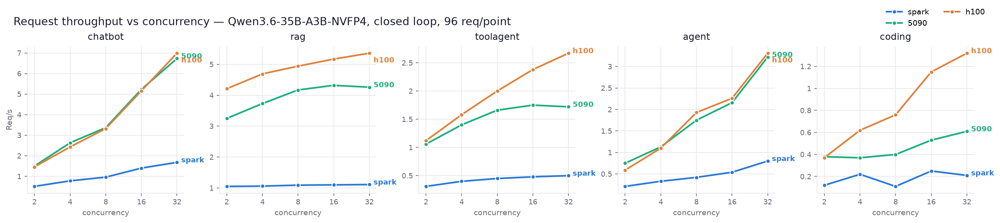
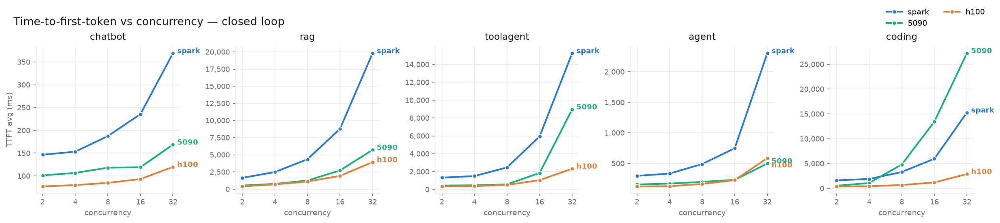
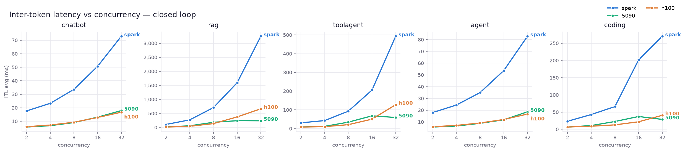
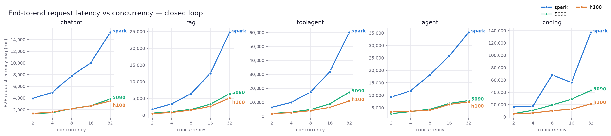
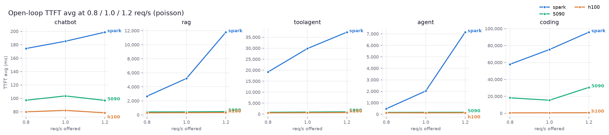
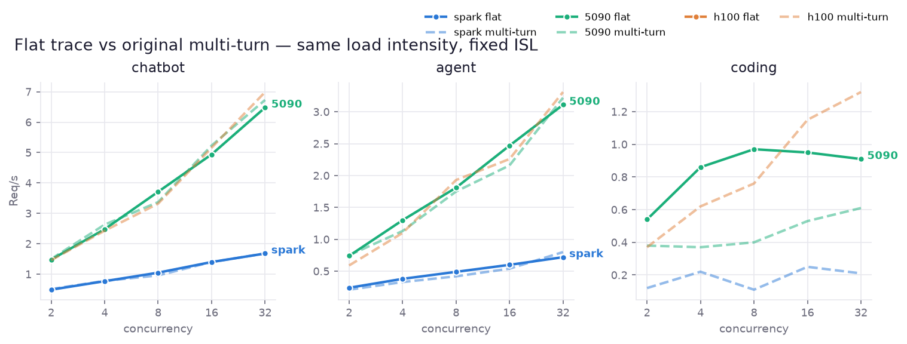
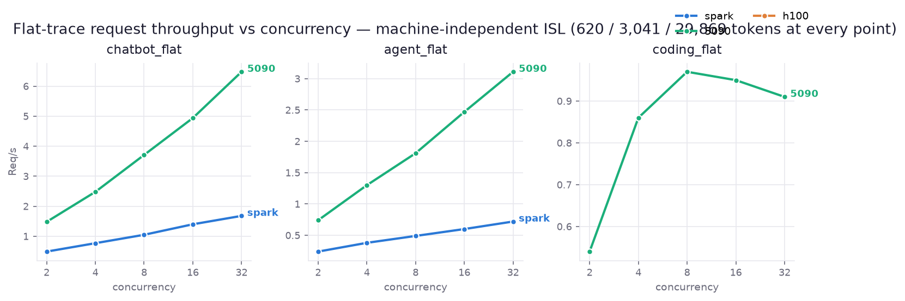
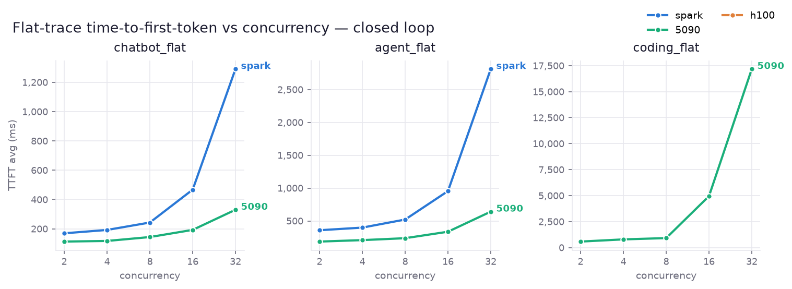
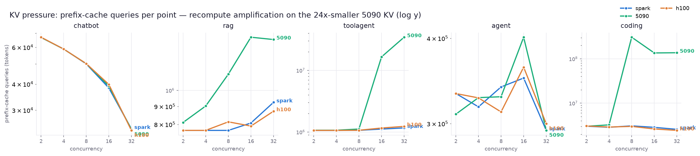

# Results — NVFP4 cross-hardware: GB10 Spark vs RTX 5090 vs H100 PCIe

`nvidia/Qwen3.6-35B-A3B-NVFP4` on vLLM **v0.24.0**, 2026-07-03 (Spark/5090), 2026-07-13 (H100).
**163 points**: 3 machines × 5 workloads × (concurrency 2/4/8/16/32 closed-loop + 0.8/1.0/1.2
req/s poisson open-loop) + a fixed-schedule Mooncake replay on each + flat-trace variants
(chatbot/agent on Spark+5090, coding on the 5090) with machine-independent ISL — see the
flat-trace section. 96 requests/point,
reasoning/thinking OFF, OSL cap 2048, prefix cache reset before every point, server
restarted between workloads, aiperf 0.10 client co-located on each machine.
Full methodology + incident log: [`results/nvfp4/SUMMARY_nvfp4.md`](results/nvfp4/SUMMARY_nvfp4.md);
raw per-point tables (all 3 machines): [`results/nvfp4/SUMMARY_tables.md`](results/nvfp4/SUMMARY_tables.md);
per-run Grafana windows: [`results/nvfp4/GRAFANA_LINKS.md`](results/nvfp4/GRAFANA_LINKS.md).

## Configuration

| | Spark (GB10, 128 GB unified) | RTX 5090 (32 GB) | H100 PCIe (80 GB) |
|---|---|---|---|
| image | `vllm/vllm-openai:v0.24.0` (cu130) | `v0.24.0-x86_64-cu129` (driver 575) | `vllm/vllm-openai:v0.24.0` (cu130, driver 610) |
| gpu-mem-util / batched-tokens | 0.5 / 32768 | 0.9 / 8192 | 0.9 / 32768 |
| max-model-len / max-num-seqs | 131072 / 32 | 131072 / 32 | 131072 / 32 |
| **KV cache** | **1,216,668 tokens** | **263,144 tokens (4.6× smaller)** | **2,233,226 tokens (largest)** |
| CPU offload | none | none | none (weights fit in 80 GB) |
| FP4 kernel | Marlin weight-only (sm_121 — no native FP4) | Marlin weight-only (sm_120 — same) | Marlin weight-only (sm_90 — same) |

Same kernel path on all three ⇒ clean comparison. Weights: 20.4 GiB each; single-GPU (TP=1)
everywhere. The H100 has **8.5× the 5090's KV cache** and never thrashes — its story is
KV-headroom, not raw FLOPs (on the compute-light chatbot/agent it merely ties the 5090).

## Closed loop — Req/s (c2 → c32)

| workload | spark c2/c4/c8/c16/c32 | 5090 c2/c4/c8/c16/c32 | 5090 @c32 |
|---|---|---|--:|
| chatbot | 0.5 / 0.8 / 1.0 / 1.4 / 1.7 | 1.5 / 2.6 / 3.4 / 5.2 / 6.7 | **3.9×** |
| rag | 1.1 / 1.1 / 1.1 / 1.1 / 1.1 | 3.2 / 3.7 / 4.2 / 4.3 / 4.3 | **3.9×** |
| toolagent | 0.3 / 0.4 / 0.5 / 0.5 / 0.5 | 1.1 / 1.4 / 1.7 / 1.8 / 1.7 | **3.4×** |
| agent | 0.2 / 0.3 / 0.4 / 0.5 / 0.8 | 0.8 / 1.1 / 1.8 / 2.2 / 3.2 | **4.0×** |
| coding | 0.1 / 0.2 / 0.1 / 0.2 / 0.2 | 0.4 / 0.4 / 0.4 / 0.5 / 0.6 | **3.0×** |



## Closed loop — TTFT avg, ms (c2 → c32)

| workload | spark | 5090 |
|---|---|---|
| chatbot | 147 / 153 / 188 / 236 / 369 | 101 / 107 / 118 / 119 / 169 |
| rag | 1,643 / 2,484 / 4,351 / 8,787 / 19,812 | 512 / 765 / 1,246 / 2,730 / 5,713 |
| toolagent | 1,328 / 1,501 / 2,473 / 5,937 / 15,254 | 440 / 472 / 573 / 1,854 / 8,973 |
| agent | 295 / 333 / 489 / 748 / 2,305 | 154 / 169 / 197 / 230 / 498 |
| coding | 1,640 / 1,903 / 3,315 / 5,968 / 15,280 | 541 / 1,098 / 4,829 / 13,435 / 27,217 ← KV thrash |



Single-user decode (c2): **5090 ≈ 157–178 tok/s/user vs Spark ≈ 30–57** (≈3.2×).
Output throughput @c32: chatbot 1,414 vs 352 tok/s; agent 1,343 vs 328; coding 396 vs 141.

## Closed loop — ITL avg, ms (c2 → c32)

| workload | spark | 5090 |
|---|---|---|
| chatbot | 18 / 23 / 34 / 51 / 73 | 6 / 7 / 9 / 13 / 18 |
| rag | 107 / 270 / 707 / 1,594 / 3,252 | 18 / 58 / 183 / 241 / 237 |
| toolagent | 31 / 43 / 93 / 206 / 493 | 9 / 12 / 34 / 68 / 59 |
| agent | 18 / 24 / 35 / 54 / 83 | 6 / 7 / 9 / 12 / 19 |
| coding | 23 / 43 / 66 / 202 / 270 | 7 / 11 / 23 / 37 / 29 |



Spark ITL degrades steeply with concurrency (rag c32 hits 3.3 s/token — decode fully
compute-bound); the 5090 stays under 70 ms everywhere except rag. Note rag/toolagent/coding
ITL on the 5090 *improves* from c16→c32 — preempted requests re-enter with warm prefixes.

## Closed loop — E2E request latency avg, s (c2 → c32)

| workload | spark | 5090 |
|---|---|---|
| chatbot | 3.9 / 5.0 / 7.8 / 10.0 / 15.2 | 1.3 / 1.5 / 2.2 / 2.7 / 3.8 |
| rag | 1.8 / 3.4 / 6.4 / 12.5 / 24.7 | 0.6 / 1.0 / 1.7 / 3.3 / 6.4 |
| toolagent | 6.4 / 9.9 / 17.3 / 31.9 / 60.1 | 1.9 / 2.8 / 4.7 / 8.8 / 17.1 |
| agent | 9.3 / 11.8 / 18.3 / 25.8 / 35.2 | 2.6 / 3.4 / 4.4 / 6.7 / 7.9 |
| coding | 16.6 / 17.4 / 68.3 / 55.9 / 137.2 | 5.2 / 10.6 / 19.4 / 28.6 / 43.1 |



## Open loop — delivered req/s (offered 0.8 / 1.0 / 1.2) and TTFT avg

| workload | spark delivered | spark TTFT (ms) | 5090 delivered | 5090 TTFT (ms) |
|---|---|---|---|---|
| chatbot | 0.8 / 0.9 / 1.0 | 174 / 185 / 199 | 0.8 / 1.0 / 1.2 | 97 / 104 / 97 |
| rag | 0.8 / 1.0 / 1.1 | 2,678 / 5,192 / 11,786 | 0.8 / 1.0 / 1.2 | 425 / 439 / 473 |
| toolagent | **0.5 / 0.5 / 0.5 (saturated)** | 19,175 / 29,841 / 37,280 | 0.8 / 1.0 / 1.2 | 840 / 943 / 1,054 |
| agent | 0.6 / 0.7 / 0.6 | 481 / 2,024 / 7,148 | 0.8 / 1.0 / 1.2 | 161 / 165 / 172 |
| coding | **0.2 / 0.2 / 0.2 (saturated)** | 57,958 / 75,344 / 95,813 | 0.5 / 0.7 / 0.6 | 18,295 / 15,424 / 30,621 |

The 0.8/1.0/1.2 band brackets Spark's capacity: it holds chatbot/agent, saturates on
toolagent (cap ≈0.5) and coding (≈0.2), and tips over on rag at 1.2 (cap ≈1.1). The 5090
absorbs every rate except coding.

## Open loop — ITL avg (ms) and E2E latency avg (s)

| workload | spark ITL | spark E2E | 5090 ITL | 5090 E2E |
|---|---|---|---|---|
| chatbot | 33 / 39 / 46 | 7.3 / 8.6 / 10.1 | 5 / 5 / 6 | 1.2 / 1.3 / 1.2 |
| rag | 341 / 1,016 / 2,642 | 3.2 / 6.6 / 15.8 | 11 / 8 / 19 | 0.4 / 0.5 / 0.5 |
| toolagent | 422 / 416 / 424 | 64.6 / 73.1 / 80.2 | 10 / 13 / 14 | 2.3 / 2.7 / 3.4 |
| agent | 70 / 74 / 76 | 30.1 / 30.9 / 41.5 | 6 / 7 / 8 | 2.9 / 3.3 / 4.1 |
| coding | 344 / 262 / 249 | 157.0 / 184.8 / 216.8 | 19 / 29 / 24 | 31.3 / 27.5 / 45.5 |

On the saturated Spark workloads E2E is queue-dominated (coding 157→217 s is mostly TTFT);
the 5090 keeps interactive-grade ITL (≤29 ms) at every offered rate.



## Fixed-schedule Mooncake replay (320 reqs, original timestamps, 60 s window ≈ 5.33 req/s)

| | delivered | TTFT avg | ITL avg | E2E avg | out tok/s | prefix-hit | KV max | drain time |
|---|--:|--:|--:|--:|--:|--:|--:|--:|
| Spark | 0.5 req/s | 314.8 s | 432 ms | 377.3 s | 87 | 24.4% | 55% | ≈11 min |
| 5090 | 1.5 req/s | 86.5 s | 59 ms | 94.4 s | 292 | 0.9% | 100% | ≈3.5 min |

Both queue the burst (over both capacities); the 5090 drains 3.6× faster at 7× lower ITL
even while its KV thrashes (96M prefix-query tokens vs Spark's 3M).

## Third machine — H100 PCIe 80 GB (KV-headroom, no thrash)

Added 2026-07-13 on a shared H100 box (repo + model + caches under `~/900g/an-hao`,
containers `an-hao-*` prefixed). 41 points, **zero failures, zero wedges** — the cleanest
run of the three; whole 40-point sweep in ~2 h. Single H100 (TP=1), no CPU offload.

| workload | H100 Req/s c2→c32 | H100 TTFT avg ms | H100 ITL avg ms | vs 5090 @c32 |
|---|---|---|---|--:|
| chatbot | 1.5 / 2.4 / 3.3 / 5.2 / 7.0 | 77 / 80 / 85 / 93 / 120 | 6 / 7 / 9 / 13 / 17 | ≈ tie |
| rag | 4.2 / 4.7 / 4.9 / 5.2 / 5.4 | 394 / 684 / 1,102 / 1,929 / 3,937 | 14 / 40 / 137 / 375 / 665 | **1.2×** |
| toolagent | 1.1 / 1.6 / 2.0 / 2.4 / 2.7 | 345 / 382 / 515 / 1,042 / 2,336 | 8 / 10 / 21 / 50 / 128 | **1.6×** |
| agent | 0.6 / 1.1 / 1.9 / 2.3 / 3.3 | 123 / 126 / 162 / 226 / 585 | 6 / 7 / 9 / 12 / 17 | ≈ tie |
| coding | 0.4 / 0.6 / 0.8 / 1.1 / 1.3 | 410 / 449 / 686 / 1,210 / 2,900 | 7 / 9 / 13 / 22 / 41 | **2.2×** |

<sub>Numbers from the monitored re-run (2026-07-13 evening, Prometheus-scraped); within
run-to-run noise of the first H100 sweep. Per-point CSVs in `results/nvfp4/h100/`.</sub>

**The KV-headroom win (the whole point of the H100 here):** with 2.23M-token KV the prefix
cache *never collapses*, exactly where the 5090/5080 thrashed —

- **coding**: prefix-hit holds **73% → 69% (c8) → 53% (c32)**; the 5090 and 5080 both fell to
  **0.1% by c8**. Result: H100 coding throughput is **2.2× the 5090** at c32 (1.3 vs 0.6 req/s)
  and TTFT stays 2.9 s where the 5090 blew out to 27 s.
- **toolagent**: hit stays flat at **~18% across c2–c32** (5090 collapsed from c16). H100 leads 1.5×.
- On **chatbot/agent** (short context, decode-bound) the H100 merely ties the 5090 — no KV
  pressure to relieve, and both are Marlin weight-only so raw decode is comparable.

Fixed-schedule Mooncake replay (same 320-req burst): H100 delivers **2.7 req/s** (Spark 0.5,
5090 1.5), TTFT avg **28.0 s** (Spark 314.8, 5090 86.5), ITL 74 ms — drains the burst fastest
of the three, its big KV keeping the queue's shared prefixes hot throughout.

**KV usage confirms the headroom** (server-side, scraped via an SSH tunnel Spark→H100 on a
monitored re-run): the H100 never exceeds **~33% KV even at c32** — coding rises only
5.3% → 14.6% (c8) → 32.5% (c32), toolagent tops out at 21%. The 5090/5080 sat pinned at
98–100% on the same points. That gap *is* the no-thrash result: the H100 has cache to spare
exactly where the smaller cards evict-and-recompute. Full server-side KV / running / waiting
time-series for all three machines are in Grafana (dashboard `b281712d…`, `node` variable);
the 2026-07-03 Spark/5090 curves were restored from TSDB snapshots (72h retention had
evicted them) and retention raised to 60 d.

## Flat-trace variants — machine-independent ISL (`*_flat`)

The conversational workloads (chatbot/agent/coding) are multi-turn, so their measured ISL
is an *emergent* property: which conversations reach which turn depth inside the 96-request
budget depends on concurrency and machine speed (e.g. coding r1.0 on Spark degenerated to
84 first-turns, ISL 13.9k vs the 5090's 21.8k — the slow machine gets easier work). To
remove that confound, `build_flat_traces.py` flattens each turn into an independent
mooncake_trace entry (the toolagent approach): declared `input_length` = accumulated
context, `output_length` = per-turn OSL **measured in the real runs** (the datasets declare
2048 everywhere, but the model EOSes at ~460/~640 — and trace mode does generate ≈ the
declared length), and `hash_ids` chain a turn to its parent's full 512-token blocks so
per-session prefix sharing survives.

**Result: ISL is bit-identical at every point on both machines** — chatbot_flat 620.07,
agent_flat 3,041.42, coding_flat 29,869.05 (all 8 points × both nodes; measured = declared
to the cent). chatbot/agent throughput stays within a few % of the original multi-turn
runs (see the overlay plot), so those flat variants are drop-in comparable. coding_flat
runs ~1.5–2× hotter than real multi-turn coding: trace order keeps each parent turn's
blocks cache-hot, while real multi-turn interleaving evicts them — treat it as an upper
bound, not a replacement.



| closed loop c2→c32 | spark req/s | 5090 req/s | spark TTFT ms | 5090 TTFT ms |
|---|---|---|---|---|
| chatbot_flat | 0.5 / 0.8 / 1.1 / 1.4 / 1.7 | 1.5 / 2.5 / 3.7 / 4.9 / 6.5 | 170 / 192 / 243 / 468 / 1,291 | 113 / 117 / 144 / 193 / 330 |
| agent_flat | 0.2 / 0.4 / 0.5 / 0.6 / 0.7 | 0.7 / 1.3 / 1.8 / 2.5 / 3.1 | 359 / 399 / 522 / 954 / 2,813 | 186 / 208 / 237 / 336 / 642 |
| coding_flat | — (5090 only) | 0.5 / 0.9 / 1.0 / 0.9 / 0.9 | — | 577 / 786 / 911 / 4,950 / 17,184 |




Open loop: both machines deliver the offered 0.8/1.0/1.2 on chatbot_flat; agent_flat
saturates Spark at ≈0.6 (TTFT 1.5→5.9 s) while the 5090 absorbs all rates (TTFT ~190 ms);
coding_flat on the 5090 caps at ≈0.9 req/s.

Prefix-hit also becomes deterministic — agent_flat ≈43% and coding_flat ≈71% at every
uncontended point, on both machines. Two observations worth keeping:

- **coding_flat reproduces the 5090 KV thrash on schedule** (hit 71% → 40% at c16/c32,
  TTFT 0.9 s → 17.2 s) but milder than real multi-turn (which fell to 0.1% hit / 27 s):
  trace order keeps a parent turn's blocks hot when its child arrives.
- **chatbot_flat's hit-rate is only 1.5%**: short chat turns rarely fill a 512-token
  block, so there is almost nothing shareable — a structural artifact of block-granular
  prefix caching, not a regression.

The Spark agent r0.8 EngineCore wedge did **not** reproduce on agent_flat r0.8.

## KV-capacity story

- **5090 (263K-token KV)** thrashes on long-context workloads: coding prefix-hit collapses
  72.7% → 40.2% → 0.1% by c8 with KV pinned 98–100% and prefix queries exploding 3M → 306M
  tokens/point (preempt-evict-recompute); toolagent shows the same from c16 (1M → 34.5M).
  Raw compute still keeps it ~3× ahead of Spark.
- **Spark (1.22M-token KV)** never saturates (max 55%): coding holds 53–73% hit across the
  whole sweep, queries stay flat. Cache stability doesn't close the compute gap.
- Small-context workloads (chatbot/agent): identical request streams on both machines
  (seed 42) produced identical hit/query counts — comparability check passed.



## Operational notes

- `/reset_prefix_cache` needs `VLLM_SERVER_DEV_MODE=1` in v0.24.0.
- vLLM v0.24.0 still has the **EngineCore silent-stall wedge** (running>0, zero token
  movement, no exception): reproduced twice on Spark agent r0.8 (~20 concurrent); the
  watchdog + post-sweep mop-up recovered it. One transient aiperf `ClientOSError` right
  after a server restart also auto-recovered.
- 5090 box: IPv6 egress dead (ship images from Spark via `docker save | ssh docker load`),
  Coolify periodically prunes unused images (`pin-vllm`/`pin-aiperf` sleeper containers
  left running as protection), no CUDA-13 images on driver 575.
- Prometheus scrapes both nodes with a `node` label; the vLLM dashboard splits series by
  node, and every point is tagged as a Grafana region annotation (tag `nvfp4`).

## Reproduce

```bash
python3 scripts/build_nvfp4_datasets.py
cd monitoring && docker compose up -d && cd ..
NODE=spark nohup bash scripts/run_nvfp4.sh &                    # on the Spark
NODE=5090  nohup bash scripts/run_nvfp4.sh &                    # on the 5090 (~/bench-nvfp4 mirror)
NODE=spark POINTS=fixed bash scripts/run_nvfp4.sh toolagent_ts  # timestamped replay
docker run --rm -v ~/.cache/huggingface:/hf -e HF_HOME=/hf -e HF_HUB_OFFLINE=1 \
  -v "$PWD":/work -w /work --entrypoint python3 aiperf:local \
  scripts/build_flat_traces.py                                  # flat traces (fixed ISL)
NODE=spark bash scripts/run_nvfp4.sh chatbot_flat agent_flat coding_flat
python3 scripts/collect_prom_nvfp4.py && python3 scripts/summarize_nvfp4.py --md
.venv-plot/bin/python3 scripts/plot_nvfp4.py
python3 scripts/annotate_grafana_nvfp4.py                       # tag runs in Grafana
```
