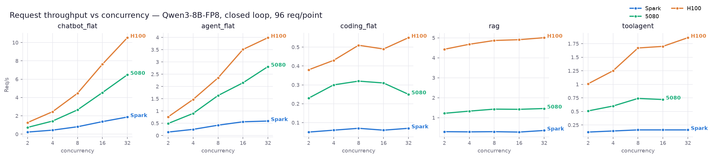
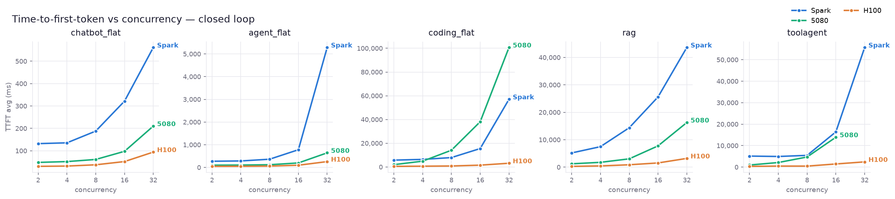
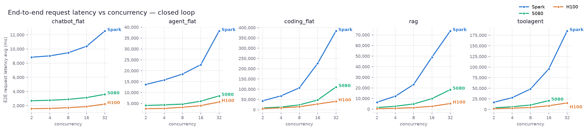
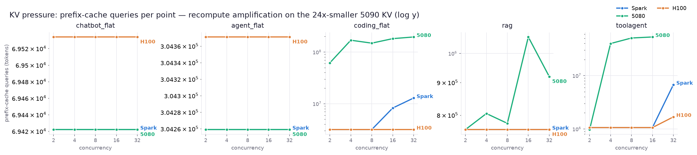
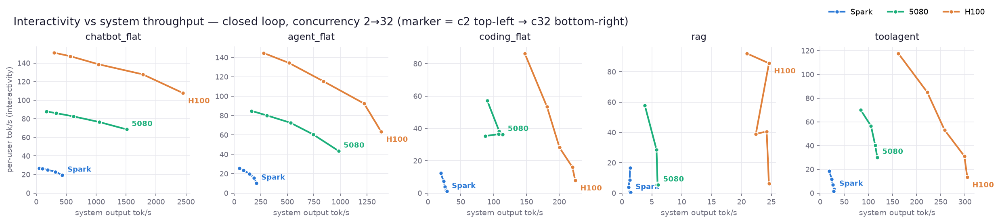
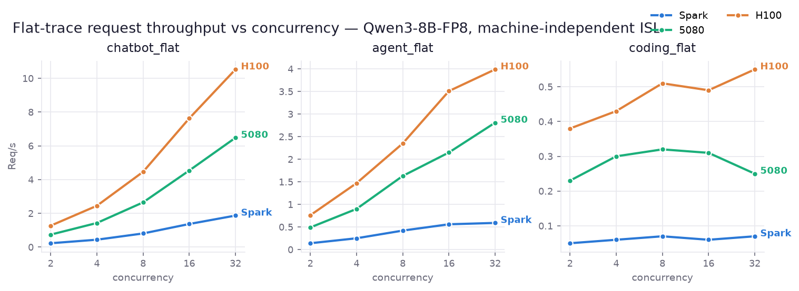

# Results — Qwen3-8B-FP8 cross-hardware: GB10 Spark vs RTX 5080 vs H100 PCIe

`Qwen/Qwen3-8B-FP8` (dense, 36 layers, GQA 8 KV-heads) on vLLM **v0.24.0**, 2026-07-21.
Same harness as the [NVFP4 35B run](RESULTS_nvfp4.md); this one swaps in a **dense 8B** model
and the **RTX 5080** in place of the 5090. **119 points**: 3 machines × 5 workloads ×
(concurrency 2/4/8/16/32 + 0.8/1.0/1.2 req/s poisson), 96 req/point, reasoning OFF, OSL cap
2048, prefix cache reset per point, server restarted per workload, aiperf co-located on each
machine. Workloads are the **flat** variants where they exist (chatbot_flat / agent_flat /
coding_flat — machine-independent ISL) plus rag / toolagent (no flat form).

Raw per-point tables: [`results/qwen3-8b-fp8/SUMMARY_tables.md`](results/qwen3-8b-fp8/SUMMARY_tables.md);
full aiperf tables: [`results/qwen3-8b-fp8/AIPERF_TABLES.md`](results/qwen3-8b-fp8/AIPERF_TABLES.md).

## Configuration

| | Spark (GB10, 128 GB unified) | RTX 5080 (16 GB) | H100 PCIe (80 GB) |
|---|---|---|---|
| image | `vllm/vllm-openai:v0.24.0` | same | same |
| context (YaRN ×4) | **131,072** | **49,152** | **131,072** |
| KV dtype | bf16 | **fp8** | bf16 |
| **KV cache** | **343,360 tokens** | **53,200 tokens** | **430,320 tokens** |
| gpu-util / batched-tokens | 0.5 / 32768 | 0.9 / 8192 | 0.9 / 32768 |
| FP8 GEMM kernel | Marlin (sm_121) | Marlin (sm_120) | **DeepGEMM block-scaled (sm_90)** |
| CPU offload | none | none | none |

Two forced deviations from the NVFP4 run's clean setup, both hardware-imposed:

1. **Kernel path is not uniform.** Qwen3-8B-FP8 uses *block-scaled* FP8; vLLM's DeepGEMM
   kernel asserts `Unknown SF transformation` on both Blackwell cards (Spark sm_121, 5080
   sm_120) and had to be disabled (`VLLM_USE_DEEP_GEMM=0` → Marlin fallback). Only the H100
   (sm_90) runs DeepGEMM. So H100 vs the others carries a kernel-path caveat.
2. **YaRN everywhere.** The model's native context is 40,960 but coding_flat reaches 77k, so
   all three run `rope_scaling=yarn factor 4.0` (→131k). The 5080's 16 GB caps it at 49,152
   (vLLM's own estimate was 53,200 tokens of fp8 KV; 65k wouldn't boot).

**Dense KV is the through-line:** at 144 KiB/token (bf16), Qwen3-8B needs ~4.5× the KV *per
token* of the 35B **MoE** NVFP4 (which activates ~3B params/token). Token capacity collapses
accordingly — the H100 holds 430k tokens here vs 2.23M on the MoE.

## Headline — on a dense 8B, the Spark GB10 is the *slowest* machine

The NVFP4 MoE run had Spark slow but respectable. Here the order is **H100 > 5080 > Spark**,
with the 16 GB consumer 5080 beating the GB10 by ~3–5× everywhere. Single-user decode (c2,
per-user output tok/s) tells the whole story — it is a pure memory-bandwidth race and the
GB10's 273 GB/s loses:

| chatbot_flat c2 | Spark | 5080 | H100 |
|---|--:|--:|--:|
| per-user tok/s | **27** | **88** | **151** |

Dense decode is bandwidth-bound; the MoE's sparsity is what previously masked the GB10's low
bandwidth. Swap the sparsity away and the little box falls behind a mid-range gaming card.

## Closed loop — Req/s (c2 → c32)

| workload | Spark | 5080 | H100 | H100 vs 5080 @c32 |
|---|---|---|---|--:|
| chatbot_flat | 0.23 / 0.44 / 0.81 / 1.37 / 1.87 | 0.74 / 1.43 / 2.65 / 4.54 / 6.48 | 1.27 / 2.45 / 4.46 / 7.63 / 10.5 | 1.6× |
| agent_flat | 0.14 / 0.25 / 0.42 / 0.56 / 0.59 | 0.49 / 0.90 / 1.63 / 2.15 / 2.81 | 0.76 / 1.47 / 2.35 / 3.51 / 3.99 | 1.4× |
| coding_flat | 0.05 / 0.06 / 0.07 / 0.06 / 0.07 | 0.23 / 0.30 / 0.32 / 0.31 / 0.25 | 0.38 / 0.43 / 0.51 / 0.49 / 0.55 | **2.2×** |
| rag | 0.30 / 0.29 / 0.30 / 0.28 / 0.36 | 1.22 / 1.33 / 1.43 / 1.42 / 1.46 | 4.43 / 4.68 / 4.87 / 4.91 / 5.01 | **3.4×** |
| toolagent | 0.12 / 0.14 / 0.16 / 0.16 / 0.16 | 0.51 / 0.60 / 0.74 / 0.72 / **✗** | 1.01 / 1.25 / 1.67 / 1.70 / 1.86 | — |



- **coding_flat is the KV-thrash workload again.** The 5080's throughput *peaks at c8 (0.32)
  and regresses to 0.25 at c32* — its 53k-token KV can't hold enough long-context requests, so
  it evict-recomputes. H100 and Spark (larger KV) climb monotonically.
- **rag** is the biggest gap: H100 3.4× the 5080 and ~15× Spark — Spark saturates at ~0.3 req/s.

## Closed loop — TTFT avg and E2E latency (c2 / c8 / c32)

| workload | Spark TTFT ms | 5080 TTFT ms | H100 TTFT ms | Spark E2E s | 5080 E2E s | H100 E2E s |
|---|---|---|---|---|---|---|
| chatbot_flat | 132 / 188 / 561 | 48 / 61 / 210 | 31 / 37 / 94 | 8.8 / 9.5 / 12.5 | 2.7 / 2.9 / 3.6 | 1.6 / 1.7 / 2.2 |
| coding_flat | 5,763 / 7,915 / 57,036 | 1,939 / 14,111 / 100,710 | 532 / 831 / 3,150 | 43.6 / 106.6 / 383.7 | 8.6 / 23.6 / 110.8 | 5.2 / 14.5 / 41.0 |
| rag | 5,192 / 14,378 / 43,647 | 1,229 / 3,040 / 16,280 | 304 / 879 / 3,202 | 6.5 / 23.2 / 73.7 | 1.5 / 4.9 / 18.4 | 0.4 / 1.4 / 5.3 |

 

coding_flat c32 TTFT on the 5080 (100 s) exceeds *Spark's* (57 s) — the thrash penalty on a
too-small KV eventually costs more than raw slowness.

## Prefix-cache hit — KV-headroom story

| workload | Spark c2/c8/c32 | 5080 c2/c8/c32 | H100 c2/c8/c32 |
|---|---|---|---|
| chatbot_flat | 63 / 63 / 63 | 63 / 63 / 63 | 63 / 63 / 63 |
| agent_flat | 75 / 75 / 75 | 75 / 75 / 75 | 74 / 74 / 74 |
| coding_flat | 76 / 76 / 56 | **80 / 55 / 42** | 76 / 76 / 76 |
| toolagent | 26 / 26 / 8 | 25 / 5 / ✗ | 25 / 25 / 16 |



Only the H100 holds coding_flat hit flat at 76% across the whole sweep. The 5080 collapses
80→42% (classic thrash), and even the GB10 dips at c32 — 343k tokens is enough headroom for
chatbot/agent but not for 32 concurrent 29k-token coding requests.

## Interactivity vs system throughput



The tradeoff curves separate cleanly by machine (H100 furthest up-and-right, Spark clustered
low-left). The 5080's coding_flat and rag curves fold back leftward at high concurrency — the
KV-thrash signature, throughput dropping as concurrency rises.

## ⚠️ 5080 caveats

- **toolagent c32 is infeasible on 16 GB** — 32 concurrent long-context requests crashed the
  vLLM engine (exit 255) on two separate attempts. Recorded as a hard failure, not retried.
  Every other 5080 point completed (39/40).
- **coding_flat and toolagent on the 5080 are measured on a *truncated* workload.** With a
  49,152-token context, requests above that (coding_flat p90 = 51k) are rejected server-side,
  so the 5080's served ISL is lower than the others (coding_flat 25,170 vs 29,098 on
  Spark/H100; toolagent 8,608 vs 9,426). Its coding_flat/toolagent throughput is therefore
  *optimistic* — it never served the hardest requests — and not directly comparable to the
  full-context machines on those two workloads. chatbot_flat / agent_flat / rag fit under 49k
  and are clean.

## Flat-trace closed loop

chatbot_flat / agent_flat / coding_flat carry a fixed ISL on every point (637 / 2,857 / 29,098
server tokens; the 5080's coding_flat is 25,170 for the reason above). 

## Reproduce

```bash
# model (all three machines): Qwen/Qwen3-8B-FP8 into each HF cache
YARN='--hf-overrides {"rope_scaling":{"rope_type":"yarn","factor":4.0,"original_max_position_embeddings":32768}}'
WLS="chatbot_flat agent_flat coding_flat rag toolagent"

# Spark (GB10, sm_121 — DeepGEMM off)
NODE=spark SERVE_MODEL=Qwen/Qwen3-8B-FP8 SERVED_NAME=qwen3-8b-fp8 TOKENIZER=Qwen/Qwen3-8B-FP8 \
  MAX_MODEL_LEN=131072 DOCKER_ENV_ARGS='-e VLLM_USE_DEEP_GEMM=0' EXTRA_ARGS="$YARN" \
  OUTBASE=results/qwen3-8b-fp8/spark CONTAINER_NAME=vllm-q38b VLLM_CNAME=vllm-q38b CPREFIX=aiperf-q38b \
  bash scripts/run_nvfp4.sh $WLS

# H100 (sm_90 — DeepGEMM works)
NODE=h100 SERVE_MODEL=Qwen/Qwen3-8B-FP8 SERVED_NAME=qwen3-8b-fp8 TOKENIZER=Qwen/Qwen3-8B-FP8 \
  MAX_MODEL_LEN=131072 EXTRA_ARGS="$YARN" HF_DIR=$HOME/900g/an-hao/hf VLLM_CACHE=$HOME/900g/an-hao/vllm-cache \
  OUTBASE=results/qwen3-8b-fp8/h100 CONTAINER_NAME=an-hao-vllm-q38b VLLM_CNAME=an-hao-vllm-q38b CPREFIX=an-hao-aiperf-q38b \
  bash scripts/run_nvfp4.sh $WLS

# 5080 (16 GB — fp8 KV, 49k context, DeepGEMM off; skip toolagent c32)
NODE=5080 SERVE_MODEL=Qwen/Qwen3-8B-FP8 SERVED_NAME=qwen3-8b-fp8 TOKENIZER=Qwen/Qwen3-8B-FP8 \
  MAX_MODEL_LEN=49152 CPU_OFFLOAD_GB=0 DOCKER_ENV_ARGS='-e VLLM_USE_DEEP_GEMM=0' \
  EXTRA_ARGS="--kv-cache-dtype fp8 $YARN" \
  OUTBASE=results/qwen3-8b-fp8/5080 CONTAINER_NAME=vllm-q38b VLLM_CNAME=vllm-q38b CPREFIX=aiperf-q38b \
  bash scripts/run_nvfp4.sh $WLS

# tables + plots (node set has no 5090)
NVFP4_RESULTS_DIR=results/qwen3-8b-fp8 NVFP4_NODES=spark,5080,h100 NVFP4_MODEL_LABEL=Qwen3-8B-FP8 \
  NVFP4_WLS=chatbot_flat,agent_flat,coding_flat,rag,toolagent \
  python3 scripts/summarize_nvfp4.py --md > results/qwen3-8b-fp8/SUMMARY_tables.md
NVFP4_RESULTS_DIR=results/qwen3-8b-fp8 NVFP4_NODES=spark,5080,h100 NVFP4_MODEL_LABEL=Qwen3-8B-FP8 \
  NVFP4_WLS=chatbot_flat,agent_flat,coding_flat,rag,toolagent \
  .venv-plot/bin/python3 scripts/plot_nvfp4.py
```
