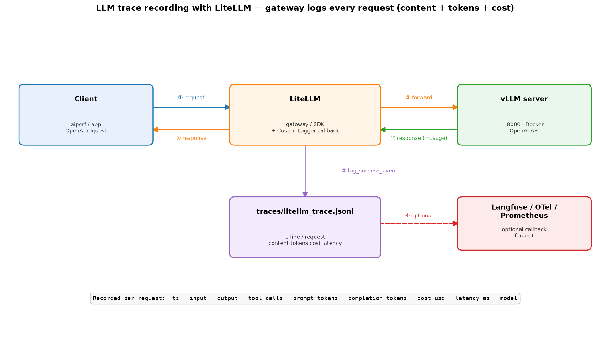

# LLM observability options for the vLLM benchmark

Five ways to capture what the model is doing, from black-box to fully instrumented. They are
complementary; pick by what you need (content vs timing, client vs server, file vs UI, cost).

Request path: **`client app → gateway → LLM server`**. "runs on" says where each tool sits;
"server" = the request-*receiving* end (vLLM), "gateway" = an intermediary that receives requests
and forwards them (the proxy, or LiteLLM in `client → litellm → llm`).

| approach | runs on | captures content? | captures timing | extra hop | backend |
|---|---|---|---|---|---|
| **Proxy** (`scripts/trace_proxy.py`) | **gateway** (client → proxy → vLLM) | ✅ full in/out/reasoning/tool_calls | client-side TTFT/latency | yes (+1 hop) | JSONL file |
| **vLLM OTLP** (`--otlp-traces-endpoint`) | **LLM server** (inside vLLM) | ❌ tokens only | ✅ server-internal (queue/prefill/decode/e2e) | no | OTel collector → file |
| **OpenLLMetry** (`scripts/openllmetry_client.py`) | **client app** (wraps OpenAI SDK) | ✅ in/out messages + tool_calls | client span; **joins** vLLM server span | no | OTLP → collector / Langfuse |
| **Langfuse** | **client app** (SDK) → its own server | ✅ (via OpenLLMetry/SDK) | ✅ (spans) | no | self-hosted UI |
| **LiteLLM** (`scripts/litellm_client.py`) | **gateway** (client → litellm → vLLM)* | ✅ in/out + tool_calls | client latency | proxy: +1 hop | callbacks + **cost** |

\* LiteLLM's normal deployment is a gateway (`client → litellm → llm`); the demo script uses its
in-process SDK form, but the role is the same request-receiving intermediary.

All five are documented here; the proxy has its own deep-dive in [`TRACING.md`](TRACING.md).

## What data each tool captures

Verified in this repo against vLLM (Qwen3.6). ✅ = captured, ⚠️ = partial/conditional, ❌ = no.

| data field | Proxy | vLLM OTLP | OpenLLMetry | Langfuse | LiteLLM |
|---|:--:|:--:|:--:|:--:|:--:|
| **runs on** | gateway (client→proxy→vLLM) | **LLM server** (in vLLM) | **client** app | **client** app SDK | **gateway** (client→litellm→vLLM) |
| **input** content (messages/prompt) | ✅ | ❌ | ✅ `gen_ai.input.messages` | ✅ | ✅ |
| **output** content | ✅ | ❌ | ✅ `gen_ai.output.messages` | ✅ | ✅ |
| **reasoning** / CoT | ✅ separate field | ❌ | ⚠️ inside output | ⚠️ inside output | ⚠️ inside output |
| **tool calls** (name + args) | ✅ | ❌ | ✅ | ✅ | ✅ |
| input tokens | ✅ | ✅ | ✅ | ✅ | ✅ |
| output tokens | ✅ | ✅ | ⚠️ (❌ on stream) | ✅ | ✅ |
| total tokens | ✅ | ⚠️ (derive) | ✅ | ✅ | ✅ |
| **TTFT** | ✅ (client) | ✅ (server) | ❌ | ⚠️ stream only (`completionStartTime`) | ⚠️ stream only |
| **e2e latency** | ✅ (client) | ✅ (server) | ✅ (span dur) | ✅ | ✅ (client) |
| queue time | ❌ | ✅ | ⚠️ via joined vLLM span | ❌ | ❌ |
| **prefill** time | ❌ | ✅ `time_in_model_prefill` | ⚠️ via joined span | ❌ | ❌ |
| **decode** time | ❌ | ✅ `time_in_model_decode` | ⚠️ via joined span | ❌ | ❌ |
| model name | ✅ | ✅ | ✅ | ✅ | ✅ |
| request / response id | ⚠️ / ✅ | ✅ `gen_ai.request.id` | ✅ `gen_ai.response.id` | ✅ | ✅ |
| finish reason | ❌ | ❌ | ✅ | ✅ | ✅ |
| sampling params (temp/top_p/max_tokens) | ❌ (in input) | ✅ | ✅ | ✅ | ✅ |
| timestamp | ✅ | ✅ (span time) | ✅ | ✅ | ✅ |
| streamed flag | ✅ | ❌ | ✅ `gen_ai.is_streaming` | ✅ | ✅ |
| HTTP status | ✅ | ❌ | ⚠️ span status | ✅ | ⚠️ |
| **cost** ($) | ❌ | ❌ | ❌ | ✅ (token×price) | ✅ **(its headline)** |
| **UI / search / evals** | ❌ | ❌ | ❌ | ✅ | ⚠️ (proxy spend UI) |
| connects client↔server in one trace | ❌ | ❌ | ✅ (W3C context) | ⚠️ (if OTLP-fed) | ⚠️ (OTel callback) |
| multi-provider / routing / fallbacks | ❌ | ❌ | ❌ | ❌ | ✅ **(its headline)** |

**One-line read:**
- **Proxy** = everything *content* + client timing, in a flat JSONL; blind to server internals.
- **vLLM OTLP** = the only source of *server-internal* timing (queue / prefill / decode); no content.
- **OpenLLMetry** = content + tokens at the client, and it *joins* the vLLM span → content **and**
  server timing in one trace. Best single lightweight tool.
- **Langfuse** = content + tokens + latency + **cost** in a real UI; no server-internal split unless
  you also feed it vLLM's OTLP.
- **LiteLLM** = a gateway/SDK: content + tokens + latency + **cost**, and it can *fan out* to the
  others (Langfuse, OTel, Prometheus) via callbacks. Headline value is routing + cost, not depth.

### Example output files (committed)

| tool | sample output | read with |
|---|---|---|
| Proxy | [`examples/trace/sample_trace.json`](../examples/trace/sample_trace.json) | `scripts/trace_summary.py` |
| vLLM OTLP | [`examples/trace/sample_vllm_spans.json`](../examples/trace/sample_vllm_spans.json) | `scripts/otel_span_summary.py` |
| OpenLLMetry | [`examples/trace/sample_openllmetry_spans.json`](../examples/trace/sample_openllmetry_spans.json) | `scripts/openllmetry_summary.py` |
| Langfuse | [`examples/trace/sample_langfuse_trace.json`](../examples/trace/sample_langfuse_trace.json) | Langfuse UI / `GET /api/public/traces` |
| LiteLLM | [`examples/trace/sample_litellm_trace.json`](../examples/trace/sample_litellm_trace.json) | plain JSON (has `cost_usd`) |

## 1. Proxy — content, any client

Transparent logging proxy; records every request to JSONL. Best for capturing real traffic
(incl. content) with no code changes. See [`TRACING.md`](TRACING.md). Caveat: adds a network hop,
so don't use it for headline latency numbers.
**Output** → [`examples/trace/sample_trace.json`](../examples/trace/sample_trace.json).

## 2. vLLM native OTLP — server-internal timing

vLLM's own OpenTelemetry spans (`gen_ai.*`): token counts + `time_in_queue`,
`time_in_model_prefill`, `time_in_model_decode`, `e2e` — no content, no extra hop. Enable with
`--otlp-traces-endpoint grpc://host.docker.internal:4317` and the OTel collector in `monitoring/`.
Read with `scripts/otel_span_summary.py`. See the "Native vLLM OTLP tracing" section of
[`TRACING.md`](TRACING.md).
**Output** → [`examples/trace/sample_vllm_spans.json`](../examples/trace/sample_vllm_spans.json).

## 3. OpenLLMetry — client instrumentation (content + timing in one trace)

[OpenLLMetry](https://github.com/traceloop/openllmetry) (Traceloop) instruments the OpenAI client.
It captures prompt/completion **content**, tokens, and tool calls as OTel spans — and because it
propagates W3C trace context, **its client span and vLLM's server span land in the same trace**, so
you get content (client) + prefill/decode/e2e timing (server) joined automatically.

```bash
# collector + vLLM-with-OTLP already running (see TRACING.md)
python3 -m venv .venv-openllmetry && .venv-openllmetry/bin/pip install -q \
  openai opentelemetry-sdk opentelemetry-exporter-otlp-proto-grpc opentelemetry-instrumentation-openai
.venv-openllmetry/bin/python scripts/openllmetry_client.py     # sends instrumented calls to vLLM
python3 scripts/openllmetry_summary.py traces/vllm_spans.jsonl # content + tokens (+ join id)
```

What it records (newer gen_ai semconv): `gen_ai.input.messages` / `gen_ai.output.messages` (full
content), `gen_ai.usage.input_tokens` / `output_tokens`, `gen_ai.response.id` (== vLLM
`gen_ai.request.id`, the join key), tool calls, finish reasons.

Verified — one trace, both spans:

```
traceId 6a837b41776b563c..
  CLIENT (OpenLLMetry): "Name three primary colors."   out_tok=40        ← content
  SERVER (vLLM)       : prefill 71 ms  decode 773 ms  e2e 849 ms          ← server timing
```

> Note: this build uses `opentelemetry-instrumentation-openai` ≥ the new gen_ai conventions, so
> content is in `gen_ai.input.messages` / `output.messages` (not the older `gen_ai.prompt.N.content`).

**Output** → [`examples/trace/sample_openllmetry_spans.json`](../examples/trace/sample_openllmetry_spans.json).

## 4. Langfuse — self-hosted UI + API

[Langfuse](https://langfuse.com) is an LLM-observability **platform**: it stores traces with full
content, token usage, latency, and cost in a searchable UI, plus evals/datasets. Self-hosted here
(Postgres + ClickHouse + Redis + MinIO + web/worker) under `monitoring/langfuse/`.

```bash
cp monitoring/langfuse/.env.example monitoring/langfuse/.env   # fill in keys / secrets
cd monitoring/langfuse && docker compose up -d && cd ../..      # UI at http://localhost:3001
# instrument vLLM calls with Langfuse's OpenAI wrapper and send traces:
set -a; . monitoring/langfuse/.env; set +a
LANGFUSE_HOST=http://localhost:3001 \
  LANGFUSE_PUBLIC_KEY=$LANGFUSE_INIT_PROJECT_PUBLIC_KEY \
  LANGFUSE_SECRET_KEY=$LANGFUSE_INIT_PROJECT_SECRET_KEY \
  .venv-langfuse/bin/python scripts/langfuse_client.py
```

- Web UI on **:3001** (Grafana keeps :3000; MinIO console remapped to 127.0.0.1:9190 to avoid
  Prometheus :9090). The project + API keys are bootstrapped headlessly via `LANGFUSE_INIT_*` in
  `.env` (no manual signup); the real `.env` is gitignored, `.env.example` is the template.
- `scripts/langfuse_client.py` uses the drop-in wrapper `from langfuse.openai import openai`, so
  each call becomes a Langfuse **generation** with input/output content, model, token usage, latency.

Verified via the public API (`GET /api/public/traces`):

```
trace primary-colors  →  GENERATION  model=qwen3.6
  input : [{"role":"user","content":"Name three primary colors."}]
  output: {"role":"assistant","content":"The three primary colors …"}
  usage : input=17 output=40 total=57   latency=0.868s
```

Tool calls are captured too (the `weather-tool` trace records the `get_weather` call). Langfuse can
also ingest **OTLP** directly (point an OpenLLMetry/OTel exporter at
`http://localhost:3001/api/public/otel/v1/traces` with basic auth) if you prefer instrumentation
over the SDK wrapper.

> Heaviest option (6 containers) but the only one with a real UI, search, evals, and cost tracking.

**Output** → [`examples/trace/sample_langfuse_trace.json`](../examples/trace/sample_langfuse_trace.json)
(one trace exported from the API; in normal use you browse them in the UI).

## 5. LiteLLM — gateway/SDK with cost + callback fan-out

[LiteLLM](https://github.com/BerriAI/litellm) is a unified API across 100+ providers (SDK or a
proxy server). For observability its strengths are **cost computation** and **logging callbacks**
that forward to the other tools (Langfuse, OpenTelemetry, Prometheus, …). `scripts/litellm_client.py`
calls vLLM via the SDK with a `CustomLogger` that records content, tool calls, tokens, latency, and
**cost** to JSONL — and registers a price for `qwen3.6` (it isn't in LiteLLM's price map).




Render the PNG with `python3 scripts/plot_litellm_arch.py`.

```bash
python3 -m venv .venv-litellm && .venv-litellm/bin/pip install -q litellm
.venv-litellm/bin/python scripts/litellm_client.py     # -> traces/litellm_trace.jsonl
```

Verified — the only tool here that emits a per-request dollar cost:

```
2026-...T06:05:03  qwen3.6  in=17  out=40  cost=$0.000018  lat=948ms  "The three primary colors…"
2026-...T06:05:04  qwen3.6  in=265 out=24  cost=$0.000036  lat=629ms  tool:get_weather
```

> Positioning: LiteLLM is the **router/hub**, not a deep tracer. In production you'd run the LiteLLM
> *proxy* in front of vLLM and point its callbacks at Langfuse/OTel — so it complements rather than
> replaces the others. Server-internal timing still only comes from vLLM's OTLP.

## When to use which

- **Debugging / content capture / dataset capture** → proxy (any client) or OpenLLMetry (Python client).
- **Authoritative perf timing** → vLLM OTLP (zero hop, server-internal).
- **Both content + timing, correlated** → OpenLLMetry (it joins to the vLLM span).
- **A searchable UI, evals, cost tracking** → Langfuse.
- **A gateway across providers + cost + fan-out to the above** → LiteLLM (run its proxy in front of vLLM).
