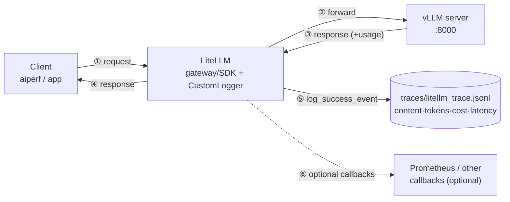

# LLM observability — LiteLLM trace + cost logging

Per-request **content, tokens, latency, and cost** are captured by calling vLLM through the
[LiteLLM](https://github.com/BerriAI/litellm) SDK with a logging callback. LiteLLM is a unified
gateway/SDK across 100+ providers; for observability its distinguishing features are **cost
computation** and **pluggable logging callbacks**. `scripts/litellm_client.py` registers a
`CustomLogger` that writes one JSON record per request to `traces/litellm_trace.jsonl`.

Request path: **`client → LiteLLM → vLLM`**. The callback fires on each response, after LiteLLM has
the model's `usage`, so every record carries exact token counts and a computed dollar cost.

## Architecture




Render the PNG with `python3 scripts/plot_litellm_arch.py`.

## Run

```bash
python3 -m venv .venv-litellm && .venv-litellm/bin/pip install -q litellm
.venv-litellm/bin/python scripts/litellm_client.py     # -> traces/litellm_trace.jsonl
```

vLLM's `qwen3.6` isn't in LiteLLM's price map, so the script registers a demo price
(`$0.10 / $0.40` per 1M input/output tokens) — swap in your real rate. Point the SDK at a different
server with `VLLM_BASE=http://host:port/v1`, or the output file with `TRACE_FILE=...`.

## What it records (one JSON object per request)

| field | meaning |
|---|---|
| `ts` | request start — ISO 8601 (UTC) |
| `model` | model name sent to vLLM |
| `input` | full request `messages` (roles + content) |
| `output` | assistant text (`null` when the turn is a tool call) |
| `tool_calls` | `[{name, arguments}]` when the model calls a tool (`null` otherwise) |
| `prompt_tokens`, `completion_tokens`, `total_tokens` | from vLLM `usage` |
| `cost_usd` | LiteLLM `response_cost` (token counts × registered price) |
| `latency_ms` | callback `start_time → end_time` |

Verified — the per-request dollar cost is LiteLLM's headline:

```
2026-...T06:05:03  qwen3.6  in=17   out=40  cost=$0.000018  lat=948ms  "The three primary colors…"
2026-...T06:05:04  qwen3.6  in=265  out=24  cost=$0.000036  lat=629ms  tool:get_weather
```

A committed sample is [`examples/trace/sample_litellm_trace.json`](../examples/trace/sample_litellm_trace.json)
(the JSONL pretty-printed). Inspect a live file with `jq`:

```bash
jq -c '{ts, in:.prompt_tokens, out:.completion_tokens, cost_usd, latency_ms}' traces/litellm_trace.jsonl
```

## What it does *not* capture

LiteLLM sees the request from the **client/gateway** side, so it records content, tokens, and
end-to-end latency — but not vLLM's *server-internal* timing (queue time, prefill vs decode). For
that, and for live throughput/KV-cache/running-vs-waiting, scrape vLLM's `/metrics` with the
Prometheus + Grafana stack in [`monitoring/`](../monitoring/) (`docker compose up -d`, Grafana on
:3000). In production you'd run the LiteLLM **proxy** in front of vLLM and fan its callbacks out to
those backends; the request path and the recorded fields are the same as the in-process SDK demo here.
