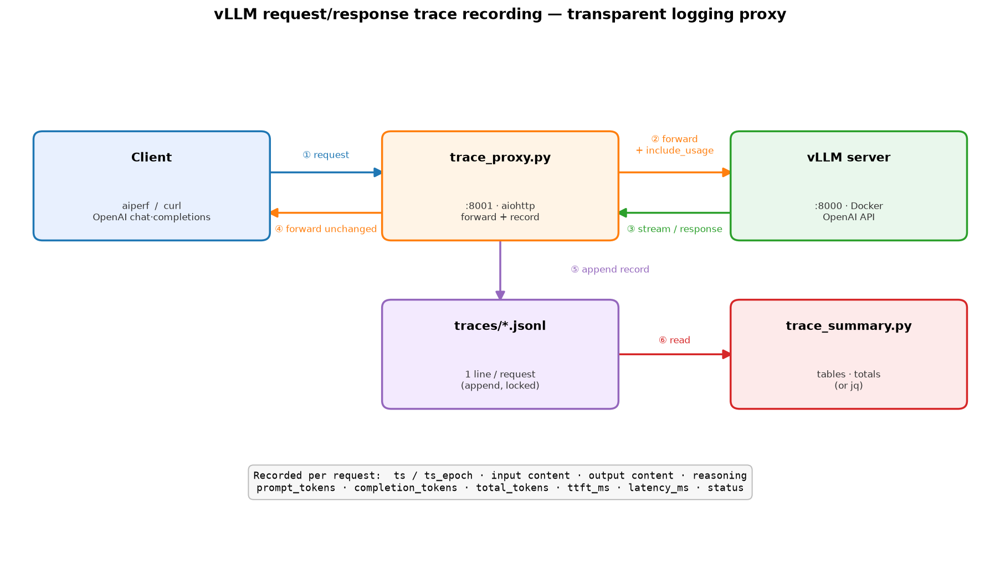
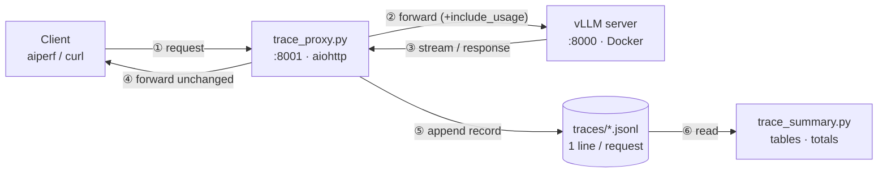

# Recording vLLM request/response traces

A transparent logging **proxy** that sits in front of the vLLM OpenAI server and records every
request to a JSONL file: **input content, output content, input/output token counts, and
timestamps** (plus TTFT, latency, and reasoning content). vLLM's own OpenTelemetry tracing captures
timing and token counts but **not** the prompt/response text, so this proxy fills that gap without
modifying or rebuilding vLLM.

## Architecture





Render the PNG with `python3 scripts/plot_trace_arch.py`.

## Run

```bash
# 1. vLLM already serving on :8000 (scripts/serve_vllm.sh)
# 2. start the proxy (creates .venv-trace + installs aiohttp on first run)
scripts/run_trace_proxy.sh
#    defaults: :8001 -> http://localhost:8000, logs to traces/vllm_trace.jsonl
#    override: TRACE_PORT=8001 VLLM_UPSTREAM=http://localhost:8000 \
#              TRACE_FILE=traces/run1.jsonl scripts/run_trace_proxy.sh

# 3. point any client at the proxy port instead of vLLM
curl -s http://localhost:8001/v1/chat/completions -H 'Content-Type: application/json' \
  -d '{"model":"qwen3.6","messages":[{"role":"user","content":"hi"}]}'
```

The proxy is transparent: any path it doesn't record (`/health`, `/v1/models`, `/metrics`, …) is
forwarded verbatim. Only `/v1/chat/completions` and `/v1/completions` produce trace records.

## Record schema (one JSON object per line)

| field | meaning |
|---|---|
| `ts`, `ts_epoch` | request received — ISO 8601 (UTC) and epoch seconds |
| `request_id` | vLLM `x-request-id` response header, if present |
| `response_id` | completion `id` (`chatcmpl-…`) — equals OTLP `gen_ai.request.id`, so content and timing join |
| `endpoint`, `model`, `streamed` | which API, model name, streaming or not |
| `input` | full request content — `{"messages": [...]}` (chat) or `{"prompt": "..."}` |
| `output` | the assistant's full reassembled text |
| `reasoning` | chain-of-thought text, recorded separately (null when thinking is off) |
| `tool_calls` | list of `{id, name, arguments}` when the model calls a tool (null otherwise) |
| `prompt_tokens`, `completion_tokens`, `total_tokens` | from vLLM `usage` |
| `ttft_ms` | time to first token (streaming; first reasoning *or* content token) |
| `latency_ms` | request received → last byte |
| `status` | upstream HTTP status |

**Token counts on streaming requests**: clients that stream don't always set
`stream_options.include_usage`, so vLLM wouldn't emit a usage chunk. The proxy injects it upstream
(and still forwards every chunk to the client unchanged), so streamed requests always get exact
token counts.

## Example

A committed sample (4 varied records + a reproduce script) lives in
[`examples/trace/`](../examples/trace/) — run `examples/trace/record_sample.sh` to regenerate it.

## Native vLLM OTLP tracing (alongside the proxy)

The proxy captures **content**; vLLM's built-in OpenTelemetry tracing captures **authoritative,
server-internal timings** (queue time, prefill/decode, e2e) and token counts as spans — with **no
extra hop**. Run both and correlate by request id; they are complementary.

```
vLLM  --otlp-traces-endpoint grpc://host.docker.internal:4317
      │  (gen_ai.* spans: tokens, time_in_queue, time_to_first_token, e2e)
      ▼
OTel Collector (monitoring/ : bench-otel-collector, :4317 gRPC / :4318 HTTP)
      │  file exporter
      ▼
traces/vllm_spans.jsonl   ──►  scripts/otel_span_summary.py
```

Enable it:

```bash
# 1. start the collector (part of the monitoring stack)
cd monitoring && docker compose up -d otel-collector && cd ..
# 2. serve vLLM with the OTLP endpoint (+ tool flags here too)
EXTRA_ARGS="--enable-auto-tool-choice --tool-call-parser hermes \
  --otlp-traces-endpoint grpc://host.docker.internal:4317" \
  REASONING_PARSER=qwen3 GPU_UTIL=0.85 MAX_NUM_SEQS=32 \
  MAX_MODEL_LEN=248320 MAX_NUM_BATCHED_TOKENS=248320 bash scripts/serve_vllm.sh
# 3. after traffic, read the spans
python3 scripts/otel_span_summary.py traces/vllm_spans.jsonl
```

Spans land in `traces/vllm_spans.jsonl` (OTLP-JSON, one batch per line). The collector is pinned to
`otel/opentelemetry-collector-contrib:0.119.0` and runs as root so it can write the host-mounted
file. vLLM reaches the collector via `host.docker.internal` (the serve script already adds that host).

| proxy (content) | OTLP (timing) |
|---|---|
| full input / output / reasoning / tool_calls | token counts only (no content) |
| client-side TTFT / latency (+1 hop) | server-internal: queue, TTFT, e2e, scheduler (no hop) |
| any OpenAI server, no vLLM change | vLLM-native, needs an OTLP collector |

## Inspect a trace

```bash
python3 scripts/trace_summary.py traces/vllm_trace.jsonl          # per-request rows + totals
python3 scripts/trace_summary.py traces/vllm_trace.jsonl --head 20
# or just jq it:
jq -c '{ts, in:.prompt_tokens, out:.completion_tokens, ttft_ms}' traces/vllm_trace.jsonl
```

## Recording a whole benchmark run

aiperf runs with `--network host`, so `localhost:8001` inside the container reaches the host proxy.
Route the sweep through it by overriding the client URL:

```bash
scripts/run_trace_proxy.sh &                       # proxy on :8001
URL=http://localhost:8001 GPU_UTIL=0.85 MAX_NUM_SEQS=32 \
  MAX_MODEL_LEN=248320 MAX_NUM_BATCHED_TOKENS=248320 \
  bash scripts/run_final.sh chatbot                # every request is traced
```

> **Caveat for clean perf numbers**: the proxy adds one network hop, which slightly inflates TTFT
> and latency. Use it for trace capture / content inspection / debugging; for the headline benchmark
> numbers, measure against vLLM (`:8000`) directly. Traces and the venv are gitignored.

## Sample (12 real RAG requests through the proxy)

```
ts                              in    out  ttft_ms    lat_ms  input -> output
--------------------------------------------------------------------------------------------------
2026-...T19:07:17.681914      5815      2     4288      4589  You are a retrieval-augmented QA … -> Yes
2026-...T19:07:17.683258      3528      4     4588      4588  You are a retrieval-augmented QA … -> Sam Altman
2026-...T19:07:17.682187      5169      6     4590      4590  You are a retrieval-augmented QA … -> Sam Bankman-Fried
...
--------------------------------------------------------------------------------------------------
requests=12  input_tokens=71,921  output_tokens=50  total_tokens=71,971
latency_ms  avg=4945  min=4588  max=5191
ttft_ms     avg=4854  min=4288  max=5165
```

Four requests share the same `ts` second (concurrency 4); RAG is prefill-bound so `ttft_ms ≈
latency_ms` (tiny outputs). Each record carries the full prompt and answer text (elided above).
