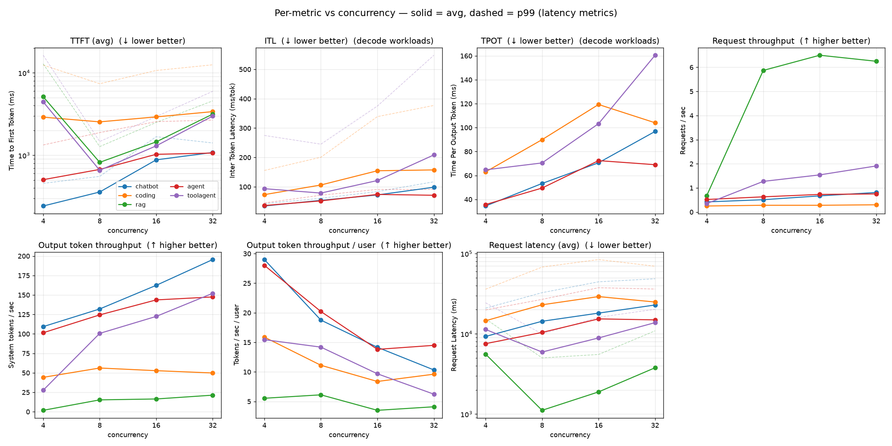
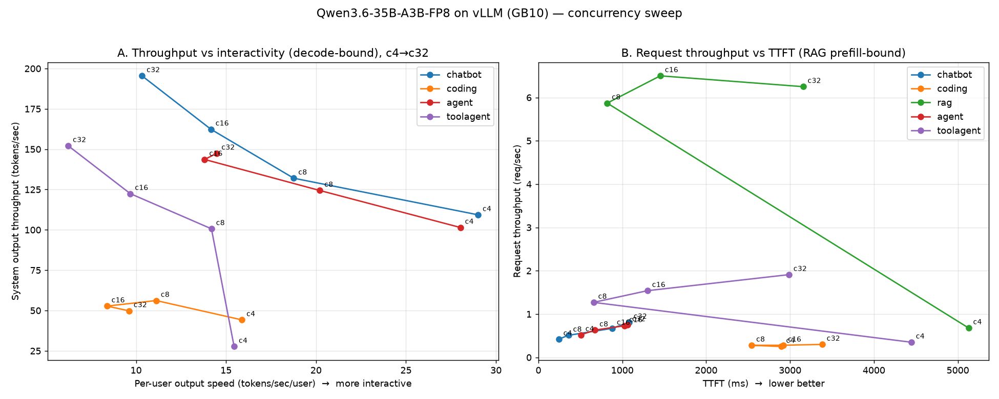

# Pass-2 concurrency sweep (historical) — figures

Figures for the **earlier** concurrency sweep (the original "Pass 2" in the repo-root
[`RESULTS.md`](../RESULTS.md)), rendered with the same `scripts/plot_pareto.py` used for v6 so the
two are directly comparable. Source data: `results/sweep/` (gitignored). For the authoritative final
run see [`../report_v6/`](../report_v6/).

## How this differs from v6

| | Pass-2 (this folder) | v6 ([report_v6](../report_v6/)) |
|---|---|---|
| Server image | `vllm/vllm-openai:latest` | nightly `dgx-vllm-eugr-nightly-tf5:20260614` |
| `--gpu-memory-utilization` | 0.90 | 0.85 |
| `--max-model-len` / batch tokens | 65536 / default | 248320 / 248320 |
| Thinking (reasoning) | **on** for chatbot/agent/toolagent, off for coding/rag | **off** everywhere except coding |
| Output cap | small (e.g. toolagent capped 128) | 5000 (toolagent = trace len) |
| Termination / counts | modest fixed counts (chatbot 40, rag 80, coding 10 conv, agent 12 conv, toolagent 40) | chatbot/rag/toolagent 160; agent/coding duration 300 s + 300 s grace |
| Concurrency levels | 4 / 8 / 16 / 32 for **all** workloads | 4/8/16/32 for chatbot,rag; 4/8/16 for the rest |

Because of these differences the numbers are **not** directly comparable point-for-point with v6 —
this is the older exploration, kept for history.

## Figures

- Pareto overview — `figures/pareto.png`
- Per-workload knees — `figures/pareto_per_workload.png`
- Throughput-per-GPU frontier — `figures/pareto_per_gpu.png`
- Capped sweep vs uncapped (★) — `figures/pareto_uncapped.png`
- **Per-metric vs concurrency** — `figures/metrics_grid.png` plus individual
  `metric_{ttft,itl,tpot,req_throughput,token_throughput,token_throughput_per_user,req_latency}.png`
  (output token throughput is charted both system-level and per-user)




Numeric tables for this pass live in [`../RESULTS.md`](../RESULTS.md) under "Pass 2 — concurrency
sweep". Regenerate these figures with:

```bash
SWEEP_DIR=results/sweep OUT_DIR=report_pass2/figures python3 scripts/plot_pareto.py
```
