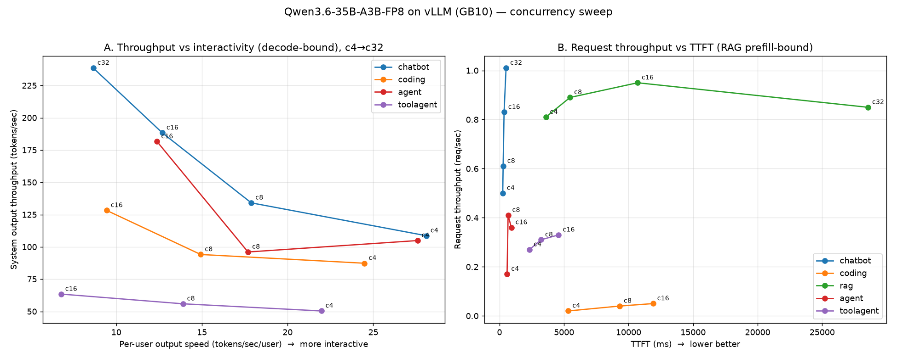
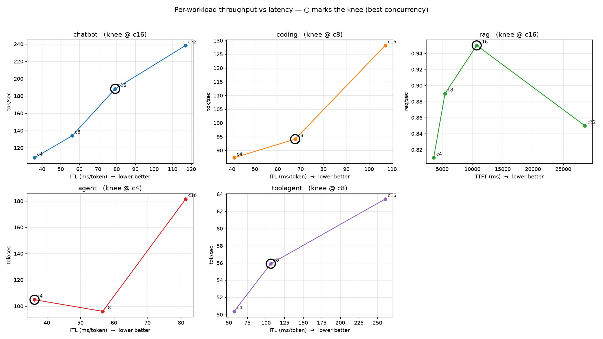
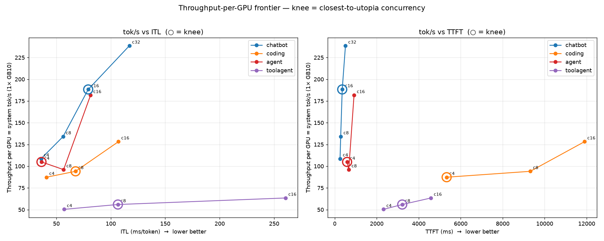
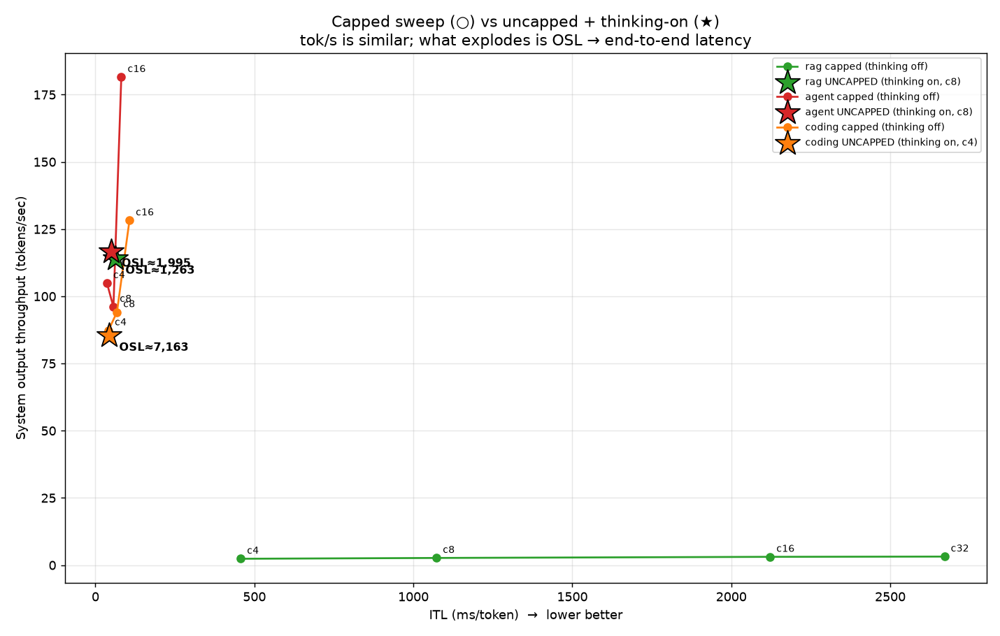
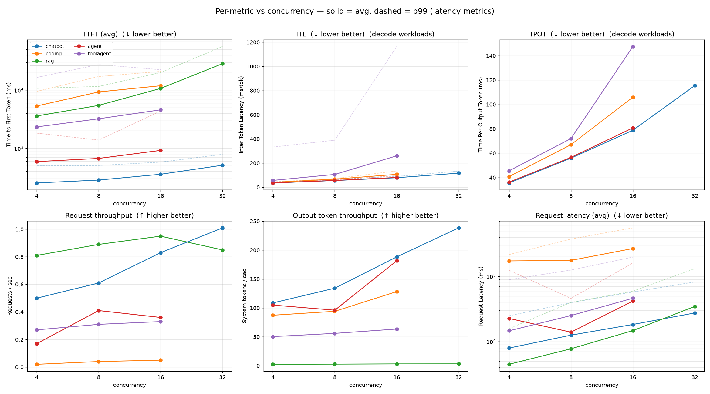

# Qwen3.6-35B-A3B-FP8 on vLLM (GB10) — v6 final concurrency sweep

Definitive 17-point benchmark of `Qwen/Qwen3.6-35B-A3B-FP8` on vLLM (GB10 / aarch64) with NVIDIA
aiperf. Server restarted before each workload; warmup per point; prefix-cache hit recorded per
point. Raw exports in `results/final/` (gitignored); full per-metric tables in
[`SUMMARY.md`](SUMMARY.md); request-format & counts in [`FORMAT.md`](FORMAT.md).

## Setup

- **Hardware**: NVIDIA GB10 (Grace-Blackwell, sm_121), 128 GB unified memory, aarch64, CUDA 13.
- **Model**: `qwen3_5_moe` — MoE 256 experts / 8 active, hybrid linear+full attention, multimodal
  VL, FP8 (e4m3), 256K native context, ~37 GB.
- **Server**: nightly `ghcr.io/spark-arena/dgx-vllm-eugr-nightly-tf5:20260614` (vLLM 0.22.1), flags:
  `--gpu-memory-utilization 0.85 --max-model-len 248320 --max-num-batched-tokens 248320
  --max-num-seqs 32 --reasoning-parser qwen3 --enable-prefix-caching`. KV cache ≈ 1.3M tokens.
- **Client**: NVIDIA aiperf 0.10.0 (`aiperf:local` container, `--endpoint-type chat --streaming`).

## Method

- **Reasoning OFF for all workloads except coding (ON)** — set via
  `chat_template_kwargs.enable_thinking=false`. `--reasoning-parser qwen3` separates
  `reasoning_content` and keeps coding's multi-turn history clean.
- **Termination**: chatbot / rag / toolagent → `--request-count 160`; agent / coding →
  `--benchmark-duration 300 --benchmark-grace-period 300` (time-boxed).
- **Concurrency sweep**: chatbot, rag → `4 8 16 32`; toolagent, agent, coding → `4 8 16`.
- **Warmup**: 32 requests/point, except **coding = 8** (32 reasoning-ON warmup requests at low
  concurrency took ~18 min and blew the time budget before profiling started).

## Results

| workload | metric | c4 | c8 | c16 | c32 |
|---|---|--:|--:|--:|--:|
| **chatbot** | tok/s · TTFT ms · prefix | 108.6 · 253 · 16.6% | 134.1 · 284 · 13.8% | 188.3 · 357 · 11.0% | 238.5 · 510 · 3.2% |
| **rag** | req/s · TTFT ms · prefix | 0.81 · 3,592 · 8.6% | 0.89 · 5,464 · 13.1% | 0.95 · 10,700 · 13.0% | 0.85 · 28,552 · 13.8% |
| **toolagent** | tok/s · TTFT ms · prefix | 50.4 · 2,327 · 20.6% | 55.9 · 3,215 · 21.3% | 63.4 · 4,585 · 21.3% | — |
| **agent** | tok/s · TTFT ms · prefix | 104.9 · 589 · 53.7% | 96.0 · 668 · 52.6% | 181.5 · 919 · 58.7% | — |
| **coding** | tok/s · TTFT ms · prefix | 87.3 · 5,330 · 45.5% | 94.1 · 9,312 · 61.5% | 128.2 · 11,900 · 67.8% | — |

Selected shape metrics (avg): chatbot ISL ~370–510 / OSL ~220 · rag ISL 6,327 / OSL ~3 ·
toolagent ISL 10,154 / OSL ~187 · agent ISL ~1.8–3.4k / OSL ~234–601 · coding ISL ~20–24k /
OSL ~2.4–4.1k. Full tables: [`SUMMARY.md`](SUMMARY.md) (plain text: `SUMMARY.txt`).

## Figures

**Overview — throughput vs interactivity, and request-throughput vs TTFT**


**Per-workload throughput vs latency (○ = knee = best concurrency)**


**Throughput-per-GPU frontier (knee marked)**


**Capped sweep (○) vs uncapped + thinking-on operating points (★)** — from the earlier exploration


## Per-metric charts (vs concurrency)

Every metric as its own chart, x = concurrency, one line per workload. Solid = avg; dashed = p99
(latency metrics). TTFT and request-latency use a log y-axis (coding/rag are orders larger).
**ITL** (Inter-Token Latency, aiperf-reported) and **TPOT** (Time Per Output Token = 1000 /
per-user output throughput) are per-output-token decode latencies, so those two cover only the
decode-bound workloads — rag's ~3-token answers make per-token latency undefined.



Individual charts: [TTFT](figures/metric_ttft.png) · [ITL](figures/metric_itl.png) ·
[TPOT](figures/metric_tpot.png) · [request throughput](figures/metric_req_throughput.png) ·
[output token throughput (system)](figures/metric_token_throughput.png) ·
[output token throughput / user](figures/metric_token_throughput_per_user.png) ·
[request latency](figures/metric_req_latency.png).

- **TTFT** rises with concurrency everywhere (more queued prefill); rag is worst (3.6 → 28.6 s)
  and chatbot best (0.25 → 0.51 s).
- **ITL / TPOT** grow ~30 → 140 ms/token as the decode batch fills — the per-user interactivity
  cost of higher concurrency. chatbot/agent have the lowest per-token latency.
- **Request throughput** is flat for the prefill-bound (rag ~0.9) and climbs for decode-bound
  (chatbot → 1.0 req/s at c32).
- **Output token throughput** climbs with concurrency for decode workloads (chatbot → 238 tok/s);
  rag sits near zero (it barely generates).
- **Output token throughput / user** does the opposite — it *falls* (28 → ~9–13 tok/s/user) as the
  decode batch fills: total throughput rises but each individual user is served more slowly. This is
  the per-user interactivity number (the inverse of TPOT).
- **Request latency** is dominated by coding (reasoning ON, long outputs → minutes); short-output
  workloads stay in the seconds.

## Reading it

- **Prefix-cache hit tracks shared context**: toolagent ~21% (shared tool/system prefixes),
  agent ~53–59% (multi-turn history re-sent each turn), coding 45→68% (shared coding-session
  history reused across the batch). chatbot *falls* with concurrency (16→3%) as the working set
  outgrows reuse; rag sits ~13% (shared corpus chunks).
- **rag is prefill-bound**: req/s stays flat (~0.8–0.95) while TTFT explodes 3.6 s → 28.6 s at c32
  — 6.3k-token inputs with ~3-token answers, so concurrency just queues prefill.
- **chatbot scales cleanly**: tok/s 108 → 238 across c4→c32 (short in/out, decode-bound).
- **coding** has the longest requests (ISL ~20–24k, OSL ~2.4–4k, reasoning ON) → request latency
  in the minutes; throughput still climbs to 128 tok/s at c16.

## Run-reliability note

The nightly image has an intermittent vLLM V1 **EngineCore deadlock** (running>0 but prompt+gen
throughput pinned at 0, KV cache low, no exception) that struck 3× during the sweep (chatbot c16,
agent c16, coding c4). `scripts/run_final.sh` watchdogs `/metrics` and KILLs a point after 120 s of
zero token movement, restarts the server, and retries (≤3) — every occurrence recovered
automatically. Details in `../RUNBOOK.md`.

## Reproduce

```bash
GPU_UTIL=0.85 MAX_NUM_SEQS=32 MAX_MODEL_LEN=248320 MAX_NUM_BATCHED_TOKENS=248320 \
  bash scripts/run_final.sh                # restarts server per workload, records prefix-hit
python3 scripts/summarize_final.py         # -> text tables (SUMMARY_v6.txt)
python3 scripts/summarize_final.py --md    # -> markdown tables (report_v6/SUMMARY.md)
python3 scripts/plot_pareto.py             # -> report_v6/figures/*.png
```
